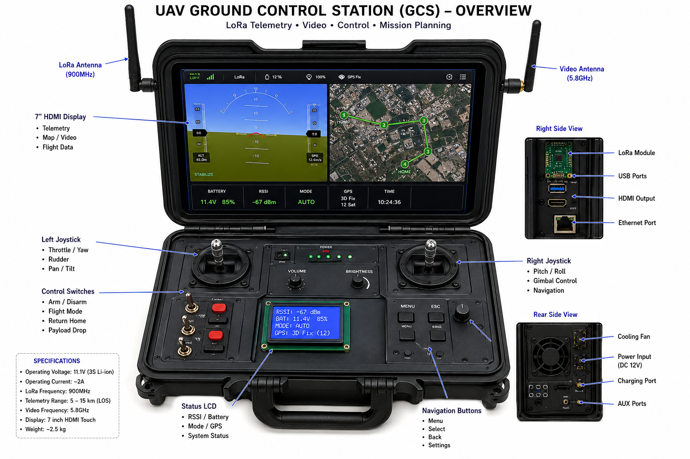

# LoRa UAV Ground Control Station

## Professional DIY UAV Ground Controller using Arduino, Raspberry Pi, and LoRa

A portable long-range UAV Ground Control Station (GCS) designed for telemetry, mission monitoring, FPV streaming, and UAV communication using LoRa telemetry systems.


---

# Project Overview

This project implements a custom UAV Ground Control Station using:

- Arduino Mega
- Raspberry Pi
- LoRa SX1278
- LCD HDMI Display
- Telemetry Monitoring
- FPV Video Streaming
- MAVLink Communication
- Touchscreen Interface
- GPS Monitoring

The system is designed for:

- UAV research
- Long-range telemetry
- Autonomous drone systems
- FPV monitoring
- Educational UAV development
- Tactical portable ground station concepts

---

# System Architecture

```text
+------------------------------------------------+
|            Ground Control Station              |
|------------------------------------------------|
| Arduino Mega                                   |
| Raspberry Pi                                   |
| LoRa SX1278 Telemetry                          |
| HDMI LCD Display                               |
| Joysticks + Buttons                            |
| FPV Video Receiver                             |
| MAVLink Communication                          |
+------------------------------------------------+
                     |
                     | LoRa RF Link
                     |
+------------------------------------------------+
|                UAV Flight System               |
|------------------------------------------------|
| Flight Controller                              |
| GPS Module                                     |
| ESC + Motors                                   |
| LoRa Telemetry                                 |
| FPV Camera                                     |
+------------------------------------------------+
```

---

# Features

## Core Features

- Long-range LoRa telemetry
- UAV manual control
- Real-time telemetry monitoring
- MAVLink communication
- GPS location tracking
- Battery monitoring
- FPV video streaming
- Flight mode switching
- Touchscreen control interface
- Mission monitoring dashboard

---

# Hardware Requirements

## Ground Station

| Component       | Description             |
| --------------- | ----------------------- |
| Arduino Mega    | Main controller         |
| Raspberry Pi 4  | Telemetry processing    |
| LoRa SX1278     | Long-range RF telemetry |
| HDMI LCD        | Display                 |
| Joystick Module | UAV control             |
| Push Buttons    | Flight controls         |
| Cooling Fan     | Thermal management      |
| Li-Ion Battery  | Portable power          |

---

# UAV Side Components

| Component         | Description         |
| ----------------- | ------------------- |
| Flight Controller | Pixhawk / Ardupilot |
| GPS Module        | Navigation          |
| ESC               | Motor control       |
| Brushless Motors  | UAV propulsion      |
| LoRa Module       | Telemetry           |
| FPV Camera        | Video streaming     |

---

# Folder Structure

```text
LoRa-UAV-Ground-Control-Station/
│
├── arduino/
│   ├── transmitter/
│   ├── receiver/
│   └── libraries/
│
├── raspberrypi/
│   ├── telemetry/
│   ├── mavlink/
│   ├── video/
│   ├── gui/
│   └── utils/
│
├── telemetry/
├── fpv/
├── docs/
├── enclosure/
├── scripts/
└── test/
```

---

# Arduino Firmware

## Features

- LoRa packet transmission
- Joystick reading
- Button controls
- PWM signal generation
- Failsafe handling
- UAV command transmission

---

# Raspberry Pi Features

## Telemetry GUI

- Live telemetry
- GPS tracking
- Battery monitoring
- Flight mode monitoring
- Signal strength display

## FPV Streaming

- Real-time video
- Video recording
- OpenCV support
- UDP video receiver

## MAVLink Integration

- UAV communication
- Mission management
- Flight mode switching
- UAV arm/disarm

---

# LoRa Configuration

| Parameter        | Value   |
| ---------------- | ------- |
| Frequency        | 433 MHz |
| Bandwidth        | 125 KHz |
| Spreading Factor | 7       |
| Coding Rate      | 4/5     |
| TX Power         | 20 dBm  |

---

# Pin Connections

## LoRa SX1278

| LoRa Pin | Arduino Mega |
| -------- | ------------ |
| VCC      | 3.3V         |
| GND      | GND          |
| NSS      | D53          |
| SCK      | D52          |
| MOSI     | D51          |
| MISO     | D50          |
| RESET    | D9           |
| DIO0     | D2           |

---

## Joystick

| Pin | Arduino |
| --- | ------- |
| VRX | A0      |
| VRY | A1      |
| SW  | D7      |

---

## Buttons

| Button      | Pin |
| ----------- | --- |
| ARM         | D22 |
| MODE        | D23 |
| RETURN HOME | D24 |

---

# Installation

## Arduino

Install libraries:

```bash
LoRa
SPI
Servo
Wire
```

Upload:

```bash
arduino/transmitter/transmitter.ino
```

and

```bash
arduino/receiver/receiver.ino
```

---

## Raspberry Pi Setup

Update system:

```bash
sudo apt update
sudo apt upgrade
```

Install dependencies:

```bash
pip3 install pyserial
pip3 install pymavlink
pip3 install opencv-python
pip3 install numpy
pip3 install folium
```

---

# Running the Ground Station

## Start Telemetry GUI

```bash
python3 telemetry_gui.py
```

## Start FPV Stream

```bash
python3 fpv_stream.py
```

## Start MAVLink Bridge

```bash
python3 mavlink_bridge.py
```

---

# Safety Features

- Signal loss detection
- Emergency failsafe
- Return-To-Home
- Battery monitoring
- GPS lock checking
- Flight mode monitoring

---

# Future Improvements

- AI object tracking
- Autonomous navigation
- Encrypted telemetry
- Swarm drone networking
- ROS2 integration
- Touchscreen mission planner
- Digital FPV system

---

# Recommended Upgrades

| Current        | Upgrade             |
| -------------- | ------------------- |
| Arduino Mega   | STM32               |
| Raspberry Pi 4 | Raspberry Pi 5      |
| SX1278         | SX1262              |
| Basic LCD      | Touchscreen Display |

---

# Development Tools

## Recommended Software

- Arduino IDE
- VSCode
- Mission Planner
- QGroundControl
- OpenCV
- MAVProxy

---

# Author

## Shivam Singh

Founder of MathTech

Research Areas:

- UAV Systems
- Embedded Systems
- RF Communication
- Autonomous Robotics
- AI Drone Systems

---

# License

MIT License

---

# Disclaimer

This project is intended for:

- Educational use
- Research
- UAV development
- Telemetry experimentation

Always follow your local UAV and RF communication regulations.

---

# Project Status

## Active Development

Features under development:

- AI-assisted flight
- Autonomous mission planner
- Mesh telemetry
- Advanced FPV integration
- Drone swarm networking
